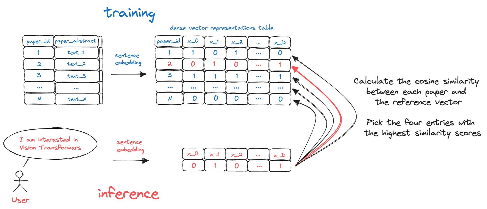
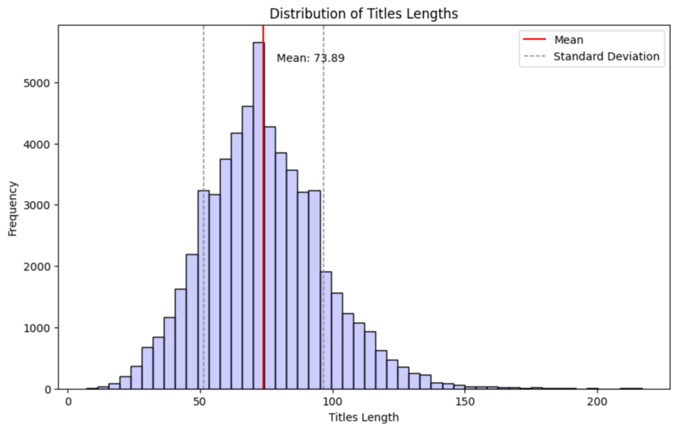
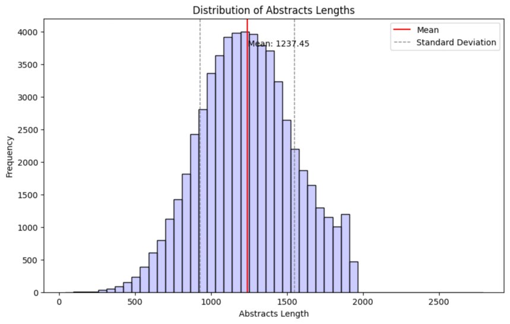
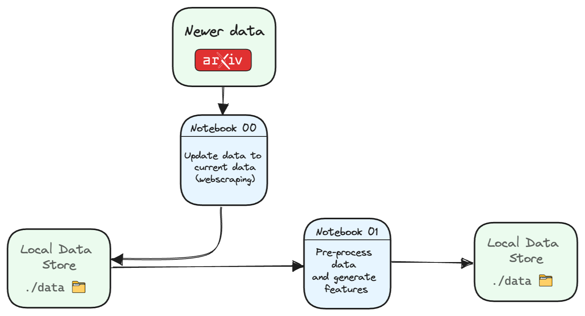
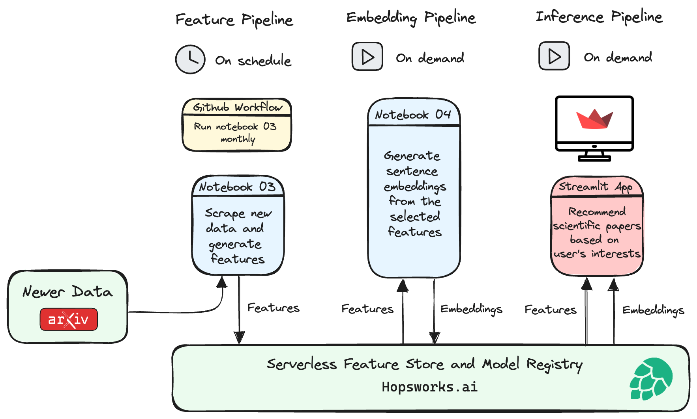
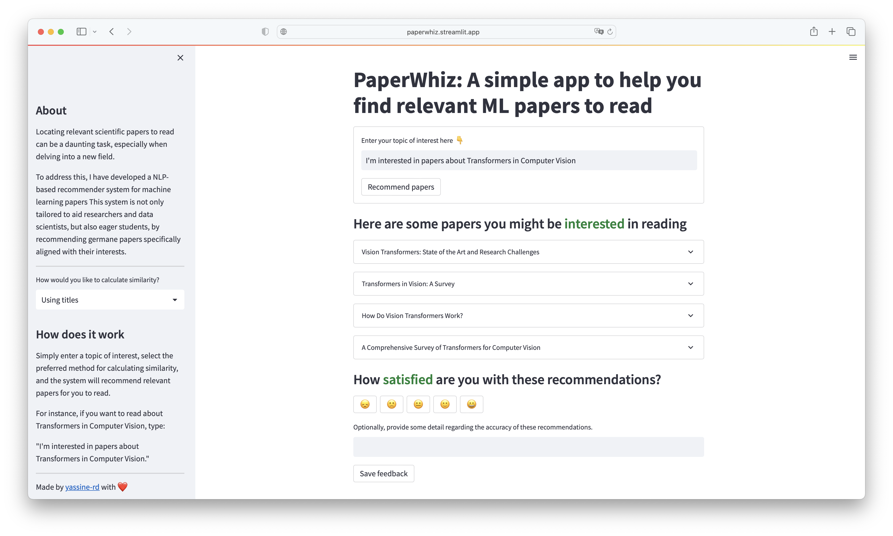

  
  
  

## Table of Contents

- [What is PaperWhiz?](#what-is-paperwhiz)
- [Problem framing](#problem-framing)
  - [Identifying the Machine Learning Problem](#identifying-the-machine-learning-problem)
  - [From Predictions to Actions](#from-predictions-to-actions)
- [Plan](#plan)
- [Observations](#observations)
  - [Distribution of titles' length](#distribution-of-titles-length)
  - [Distribution of abstracts' length](#distribution-of-abstracts-length)
- [Structure](#structure)
- [Overview](#overview)
  - [Initial Data Acquisition](#initial-data-acquisition)
  - [Production pipeline](#production-pipeline)
- [Streamlit App](#streamlit-app)
- [Report](#report)
- [Future Possibilities](#future-possibilities)
- [Acknowledgments](#acknowledgments)
- [References](#references)

## What is PaperWhiz?

PaperWhiz is an NLP-based recommender system designed to assist a wide array of users in uncovering valuable machine learning papers that align with their specific interests.

For instance, a researcher working on the application of transformers in computer vision can input a set of keywords or a brief description of their interests into the recommendation system. The system then processes the input, evaluates the similarity between the user’s interests and the available research, and recommends a list of papers that are most likely to be pertinent to the user’s research domain.

## Problem framing

The issue at hand pertains to the realm of academic research. As research expands exponentially, it has become difficult for stakeholders such as researchers, students, and science enthusiasts to keep up with the latest findings and advancements in their areas of interest. The conventional methods of tracking research papers, like going through academic journals or frequenting research platforms, are turning out to be inefficient and time-consuming.

In light of this challenge, the project aims to **enhance the accessibility and discovery of relevant research papers** through a tool called PaperWhiz. This tool is an NLP-based recommender system designed to assist a wide array of users in uncovering valuable machine learning papers that align with their specific interests.

### Identifying the Machine Learning Problem

The primary machine learning problem to tackle here is the recommendation of research papers. Specifically, the ML problem could be categorized as a content-based recommendation system, where the goal is to recommend research papers based on a user's specific interests.

### From Predictions to Actions

Once the recommender system predicts the papers a user may be interested in, the next action step would be to present these recommendations to the user. This could take the form of a tailored list where users can explore suggested papers, read their abstracts, and decide which ones to delve into further.

To evaluate the effectiveness of the recommender system, I will be using Trubrics' feedback component with Streamlit, enabling the collection of user feedback on paper recommendations to enhance user engagement and improve the system's accuracy in suggesting relevant research papers.

## Plan

- arXiv papers data is scraped from the arXiv website.
- EDA, Data Processing, and Feature Engineering are used to produce the best text data for the embedding process.
- Hugging Face Sentence Transformer ([all-MiniLM-L6-v2](https://huggingface.co/sentence-transformers/all-MiniLM-L6-v2)) is used to embed the text data.
- The similarity between papers is calculated using [cosine similarity](https://en.wikipedia.org/wiki/Cosine_similarity), once by comparing titles and once by comparing abstracts.
- Once similarity scores are calculated, the top 4 most similar papers will be recommended to the user, along with their abstracts and links to the full text.
- Pipelines will be set up to scrape new papers from the [arXiv website](https://arxiv.org/) every month and re-embed the new data collected when the pipeline is triggered.
- The application is deployed online using Streamlit.
- Evaluation will be done using the [Trubrics](https://trubrics.com/) feedback component with Streamlit, enabling the collection of user feedback on paper recommendations.

## Observations

### Distribution of titles' length

The average text length of a title is 73 characters, and its maximum length is 217 characters. Choosing a sentence-transformer model with a Max Sequence Length capability of over 217 characters would be ideal. The `all-MiniLM-L6-v2` model has a Max Sequence Length of 256, which is more than enough to process the entire title.

### Distribution of abstracts' length

The average text length of an abstract is 1237 characters, and its maximum length is 2790 characters. So the best choice is to use a sentence-transformer model with a Max Sequence Length capability of over 2790 characters.

Unfortunately, most pre-trained models have a Max Sequence Length of 512. The transformer model just won't be able to process the entire abstract at once due to its max length constraint, so it processes as much as it can, which in this case is the first 512 words.

A naive approach would be to split the document into chunks, encode each chunk separately and then combine these encodings for a final document-level representation. For example, split a document into sentences, encode each sentence independently and then combine these sentence vectors (e.g., averaging, max-pooling, etc.) for a document representation.

Another approach would be to use a "sliding window". Instead of just taking the first 512 words, I could apply a "sliding window" approach where I first process the first 512 words, then the next 512 words (perhaps with some overlap), and so on until I've processed the whole abstract.

## Structure

Jupyter Notebooks were used for initial development and testing and are labeled `00` through `05` in the notebooks folder. Notebooks `00` thru `02` are primarily just experiments and notes for the development process.

Key functions were moved to `.py` files in `src` directory once the functions were stable.

Notebooks `03`, and `04` are used in production. I chose to keep the notebooks instead of full conversion to scripts because:

- I think they look better in terms of documentation
- I prefer to peruse the notebook output after model testing and re-embedding sometimes instead of relying just on experiment tracking logs

## Overview

### Initial Data Acquisition

### Production pipeline

## Streamlit App

The application is deployed on Streamlit Sharing and can be accessed here: [paperwhiz.streamlit.app](https://paperwhiz.streamlit.app)

## Report

The project report is available [here](/assets/pdf/report.pdf). It provides a detailed explanation of the methodologies used, results obtained, and conclusions drawn from this project.

## Future Possibilities

Continual improvements might include:

- [ ] Adding more data sources.
- [ ] Finishing Hopsworks integration.
- [ ] Adding new menu to select which sentence transformer to use.
- [ ] Generating a summary of the paper recommendations instead of just the abstracts.
- [ ] Making the app context-aware by asking the user to provide more information about their interests.
- [ ] Building a Docker image for the app and deploy it on Docker Hub.
- [x] Finishing writing the project report.

## Acknowledgments

I would like to thank arXiv for use of its open access interoperability. I would also like to express my gratitude to the Trubrics team for offering their feedback component and granting me permission to test it out on my project.

## References

- [arXiv API](https://arxiv.org/help/api/index)
- [Trubrics SDK](https://trubrics.github.io/trubrics-sdk/)
- [Hugging Face](https://huggingface.co/)
- [Streamlit Documentation](https://docs.streamlit.io/en/stable/)
- [Hopsworks Documentation](https://docs.hopsworks.ai/3.2/)
- [Sentence Transformers](https://www.sbert.net/)
